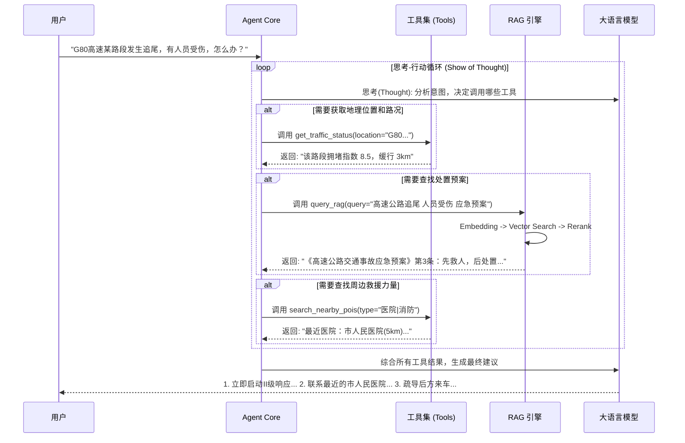

# 交通应急 Agent 技术架构与工作流详解

本文档详细介绍了交通应急 Agent 的核心技术架构、数据流转逻辑以及关键组件的实现原理。

## 1. 项目概述

**交通应急 Agent** 是一个垂直领域的智能体应用，旨在为交通指挥中心、应急管理部门提供实时的决策支持。系统采用 **ReAct (Reasoning + Acting)** 范式，结合 **RAG (检索增强生成)** 技术，能够处理复杂的应急场景，提供符合法规、结合实时路况的专业建议。

## 2. 核心技术栈

### 2.1 Agent 核心 (Brain)
*   **架构模式**: ReAct (Reasoning + Acting)
*   **基座模型**: 通义千问 (Qwen-Plus / Qwen-Max) 通过 OpenAI 兼容接口调用
*   **多模态能力**: Qwen-VL-Plus (用于现场图像/视频理解)

### 2.2 知识检索增强 (RAG)
*   **Embedding 模型**: BAAI/bge-large-zh-v1.5 (语义向量化)
*   **Rerank 模型**: BAAI/bge-reranker-large (精细重排序)
*   **检索策略**:
    1.  **Dense Retrieval**: 向量相似度检索 (Top-K)
    2.  **Reranking**: 对粗排结果进行语义相关性打分
    3.  **Context Injection**: 将高分文档片段注入 LLM 上下文

### 2.3 工具与感知层 (Tools & Perception)
*   **地理信息系统 (GIS)**: 高德地图开放平台 API
    *   地理编码 (Geocoding) / 逆地理编码
    *   周边设施搜索 (POI Search: 医院、消防队等)
    *   实时路况查询 (Traffic Status)
    *   天气查询 (Weather Info)
*   **风险评估模型**: 基于规则与历史数据的风险打分引擎

### 2.4 交互与应用层
*   **Web 框架**: Chainlit (支持流式输出、中间步骤可视化)
*   **部署环境**: Python 3.10+, Docker (可选)

---

## 3. 系统工作流 (Workflow)

系统处理用户请求的完整生命周期如下：

### 3.1 详细处理流程

#### **阶段一：意图识别与任务规划**
用户输入后，Agent 首先进行语义分析：
*   **场景识别**: 是交通事故、自然灾害还是政策咨询？
*   **关键要素提取**: 时间、地点、伤亡情况、车型等。
*   **工具规划**: 决定需要获取哪些外部信息（天气、法规、路况）。

#### **阶段二：动态工具链执行**
Agent 不是一次性调用所有工具，而是根据上下文动态决策：
1.  **感知环境**: 调用高德 API 获取事发地坐标、实时天气和拥堵情况。
2.  **知识检索**: 如果涉及具体处置流程，调用 `query_rag` 检索本地的 PDF/JSON 知识库（法规、预案）。
3.  **历史参考**: 调用 `query_historical_cases` 检索相似的历史案例作为参考。
4.  **风险研判**: 调用 `risk_assessment` 对当前方案进行安全性评估。

#### **阶段三：推理与生成**
Agent 汇总所有 Observation（观察结果），结合 System Prompt 中的角色设定（严谨、专业），生成结构化的处置建议：
*   **形势研判**: 基于路况和天气的客观描述。
*   **法规依据**: 引用具体的预案条款。
*   **行动指南**: 分步骤的处置措施（如：封锁现场 -> 救治伤员 -> 清障恢复）。

---

## 4. 核心文件结构解析

| 路径 | 说明 | 关键技术点 |
| :--- | :--- | :--- |
| `src/agent/agent.py` | **Agent 主脑** | 实现了 ReAct 循环，维护对话状态，通过 System Prompt 约束行为。 |
| `src/rag/retriever.py` | **检索器** | 集成了 BGE Embedding 和 Reranker，实现了 "Retrieve-then-Rerank" 的两阶段检索。 |
| `src/tools/gaode_tools.py` | **LBS 工具** | 封装了高德地图 API，提供了坐标转换、路径规划、POI 搜索等地理能力。 |
| `src/tools/risk_assessment.py` | **风险评估** | 独立的评估模块，用于对生成的方案进行二次校验和风险提示。 |
| `data/regulations/` | **知识库** | 存储经过切片（Chunking）处理的法规和预案数据，通常为 JSON 格式。 |
| `web_app.py` | **Web 入口** | 基于 Chainlit 构建，处理 WebSocket 连接，渲染聊天界面和地图组件。 |

## 5. 待优化的方向

1.  **知识库升级**: 目前虽有 Rerank，但随着文档量级增加，建议引入 **Milvus** 或 **ChromaDB** 等向量数据库。
2.  **并行工具调用**: 优化 Prompt，支持 `Parallel Function Calling`，减少多步工具调用的等待时间。
3.  **记忆机制**: 引入基于 Token 窗口的对话历史管理，防止长对话导致 Context Overflow。
